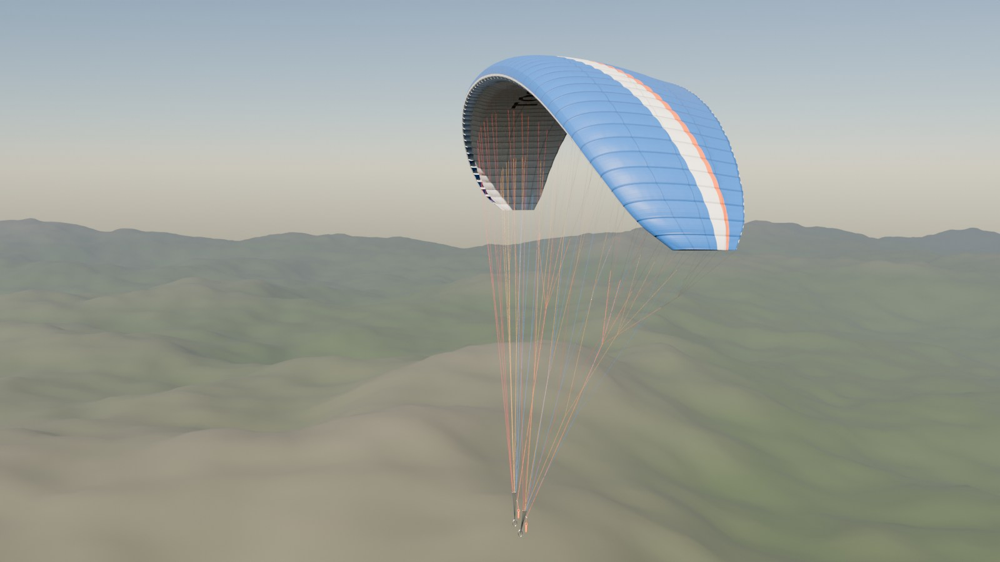
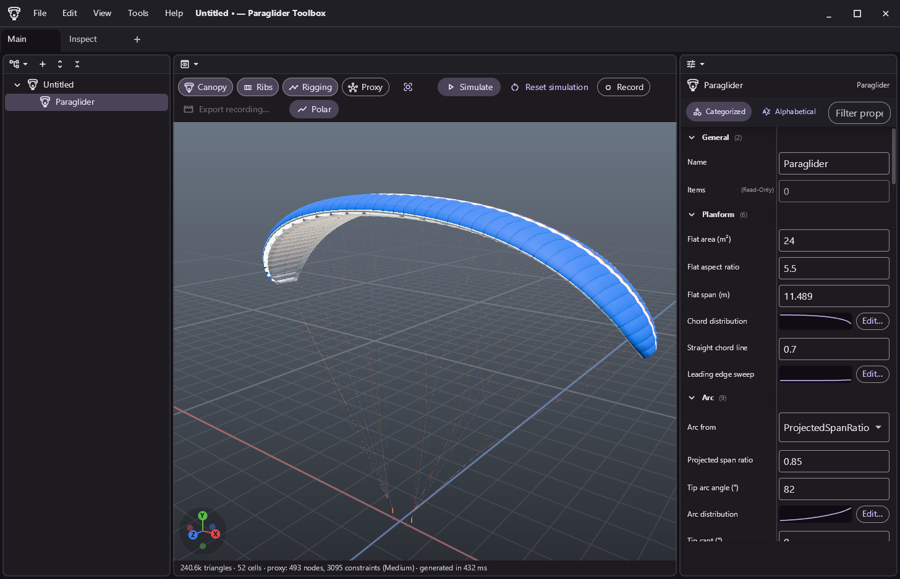
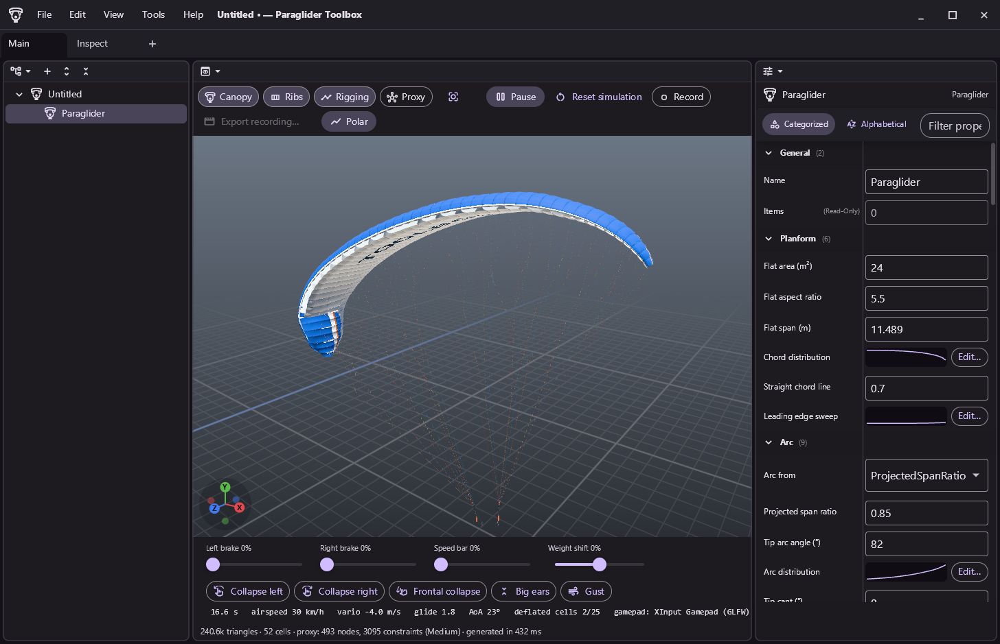
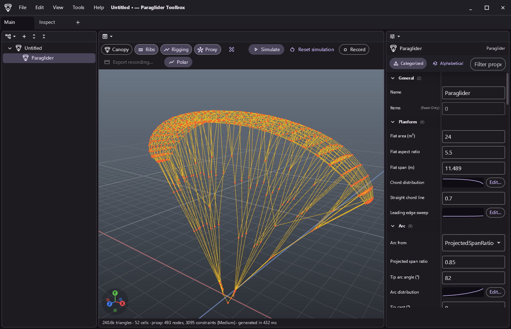
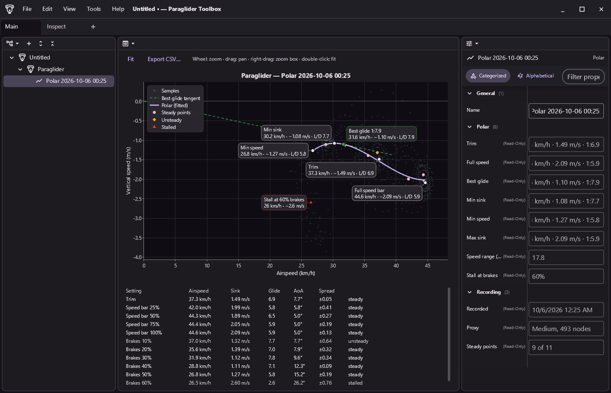
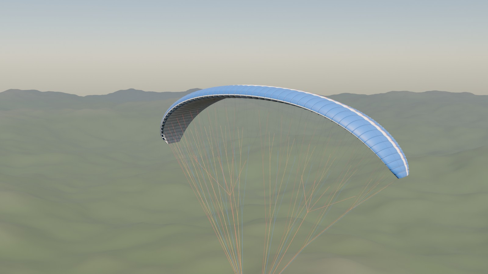
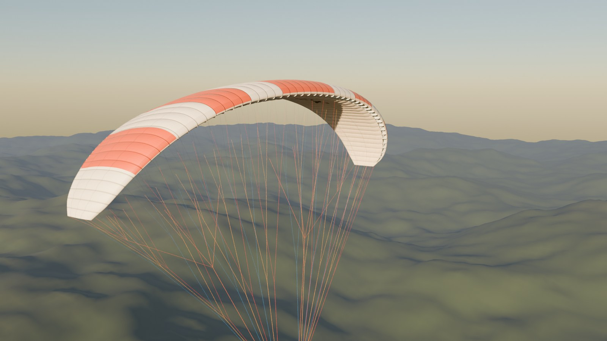
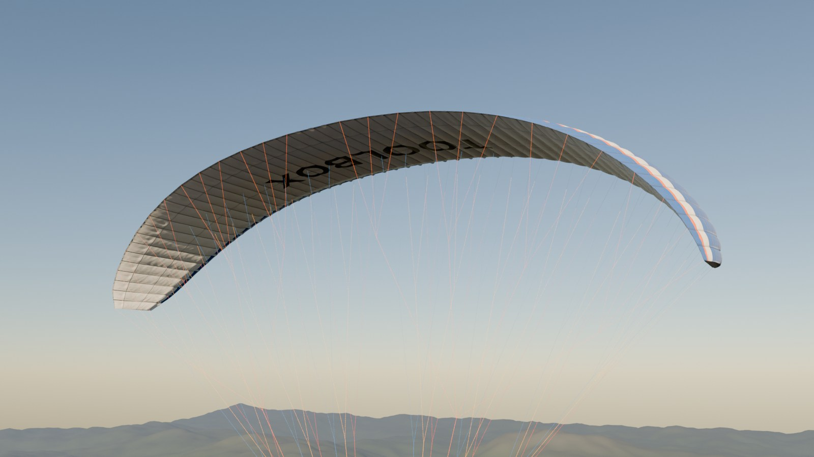
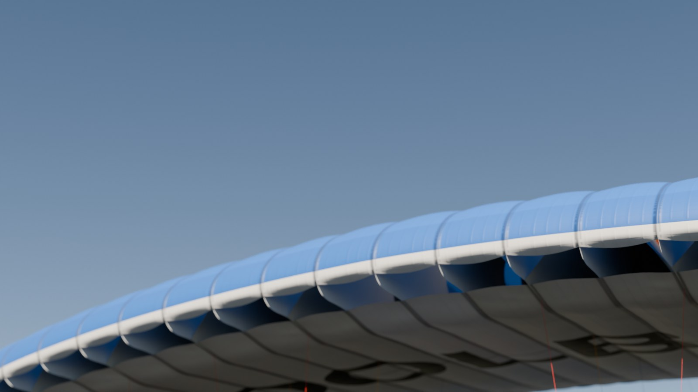

# ParagliderToolbox

Tools for paraglider simulation and games, built with the [Atelier](https://github.com/Tokter/Atelier) UI framework.





## The application shell

- **Project tree** (left): every object in the project. Right-click for Add, Rename, Duplicate, Delete and Move.
- **Detail view** (middle): the selected object's own UI.
- **Properties** (right): the selected object's properties.
- **Workspaces**: Blender-style areas that split, join and swap, each showing any of the views; workspaces in tabs.
  The layout is remembered.
- **Projects** are saved as JSON (`*.pgtproj`) from the File menu in the title bar, with recent files.
- **Command palette** (Ctrl+Shift+P) and **keyboard shortcuts editor** (Ctrl+K, Ctrl+S).

| Shortcut | Action |
|---|---|
| Ctrl+N / Ctrl+O / Ctrl+S / Ctrl+Shift+S | New, open, save, save as |
| Ctrl+Shift+P | Command palette |
| Ctrl+K, Ctrl+S | Customize keyboard shortcuts |
| Ctrl+Shift+N | Add a folder |
| F2 / Ctrl+D | Rename / duplicate the selected object |
| Delete, Alt+Up, Alt+Down | Delete or move the selected object (in the project tree) |
| Ctrl+Space | Maximize the area under the pointer |
| F12 | Developer tools (Debug builds) |

## Paraglider Model Creator

Add a paraglider (Ctrl+Shift+G, or Edit > Add) and shape it in the properties; the detail view regenerates the model
as you edit (a few hundred milliseconds) and can fly it.

- **Design parameters**, in the order of the design steps:
  - **Planform**: flat area, aspect ratio and span, chord distribution curve, straight chord line, leading edge sweep.
  - **Arc**: tip angle or a projected span ratio to solve for, the arc distribution, tip cant, washout and its axis.
  - **Airfoil**: a parametric reflexed section (NACA modified four-digit thickness: leading edge radius, maximum
    thickness position; camber, its position, reflex) or imported Selig/Lednicer `.dat` coordinates; root and tip
    thickness with a distribution curve.
  - **Inlet**: start and end, rim sag, shark nose, leading edge rods.
  - **Cells**: cell count, width distribution, mini-ribs, cross-vents, diagonal ribs.
  - **Ballooning**: amount and chordwise distribution, lower surface factor, seam creases, tab wrinkles, trailing edge
    gathering.
  - **Rigging**: 3 or 4 rows and their positions, tab and brake tab spacing, cascades, line diameters, carabiner
    position and spacing, risers, brake slack and travel, trim.
  - **Appearance**: pattern, colors, brand text, texture size, fabric translucency.
  - **Physics proxy**: complexity from Arcade to High, or custom settings; masses and drag.
  - **Mesh**: resolution, ribs, rigging.
- Distributions are curves: drag their points in the curve editor (Edit… next to the curve).
- **High resolution model** (about 240k triangles by default): ballooned skin with seam creases, wrinkles and a gathered
  trailing edge, air inlets with sagging rims, internal ribs with cross-vents, mini-ribs and diagonal ribs, tip panels,
  the line cascades as tubes in their row colors, risers, maillons, brake pulleys and toggles, carabiners; procedural
  base color and normal map textures (pattern, panel seams, stitching, tapes, ripstop, brand text).
- **Physics proxy**: mass points on the upper and lower surface (or the camber surface), fabric, rib and bending
  constraints, tension-only lines, risers and the pilot, aerodynamic strips with ram-air pressure cells, the section polar
  and the pilot's controls. The high resolution model is skinned to it.
- **Simulation** in the detail view (P): trim glide, brakes, speed bar, weight shift, asymmetric and frontal collapses,
  big ears, gusts, stalls and spins, with the high resolution model following the proxy. Record a flight (Ctrl+R) and
  export it as an animation.

  | Simulation: an asymmetric collapse | The physics proxy the high resolution model is skinned to |
  |---|---|
  |  |  |
- **Polar recorder** (Polar button, Ctrl+P): flies the proxy headless and deterministically through the speed range
  (trim, speed bar 25–100 %, then symmetric brakes in 10 % steps until it stalls), settling and then measuring each
  setting, and plots the samples live. The result is stored as a polar under the paraglider (with the design it was
  recorded with and every sample) and shown on a zoomable chart with trim, full speed, best glide (tangent from the
  origin to the fitted curve), min sink, min speed, max sink and the stall labeled, plus a table of every setting.
  Export it as CSV. `PolarRecorder` is UI-free, the building block for an optimizer that tweaks parameters and
  compares polars.

  
- **Exports** (File > Export paraglider, Ctrl+E, or the Tools menu): glTF binary with the skinned model, materials and
  textures (Blender, Godot), the proxy alone as glTF, the proxy JSON for a game ([format and algorithm](docs/ProxyFormat.md)),
  OBJ + MTL + PNG, and a line plan CSV.

| In the detail view | Action |
|---|---|
| Middle drag / Shift+middle drag / wheel | Orbit / pan / zoom |
| Home, numpad 1 3 7, numpad 5, Shift+Z | Frame, views, orthographic, wireframe |
| 1 2 3 4 | Show canopy, rigging, proxy, ribs |
| P / R | Simulate or pause / reset |
| Q, E, F, B, G | Collapse left, right, frontal, big ears, gust |
| Ctrl+R | Record the simulation |
| Ctrl+P | Record the polar (again to cancel) |
| Game controller (Xbox) | Left and right trigger: brakes; left stick: weight shift (left/right) and speed bar (forward); A: simulate or pause; left and right bumper: collapse left and right |

### Renders

Exported glTF models rendered in Blender 4.4 with Cycles (sky, procedural terrain and lighting added in Blender;
the canopy, ribs, rigging, textures and normal maps come straight from the export). `docs/images/render.py` renders
them again: `blender -b --python docs/images/render.py -- model.glb out hero,side,backlit,nose 256 1`.

| | |
|---|---|
|  |  |
|  |  |

## Building

Atelier is referenced as source and expected next to this repository:

```
D:\GitHub\Atelier
D:\GitHub\ParagliderToolbox
```

```bash
dotnet build ParagliderToolbox.slnx
dotnet test
dotnet run --project src/ParagliderToolbox
```

Settings (theme, recent files, shortcuts, layout) are kept in `%APPDATA%\ParagliderToolbox`.

## Extending

Features are modules (`IToolboxModule`) that register node types, detail views, workspace views, property editors,
JSON converters and menu items with the `Toolbox`. See [CLAUDE.md](CLAUDE.md) for the architecture.
